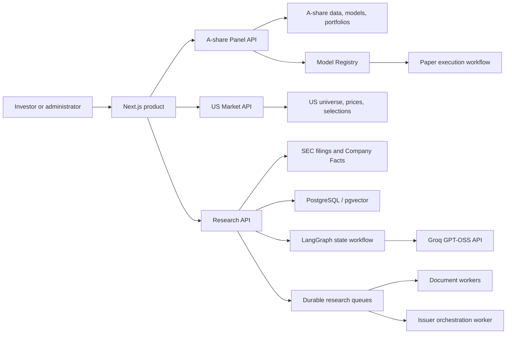
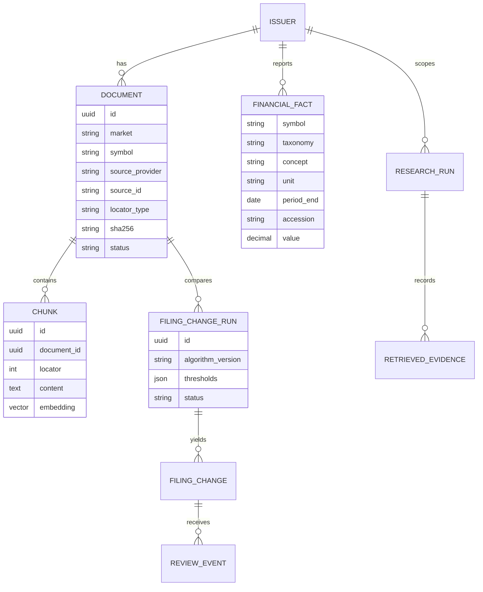
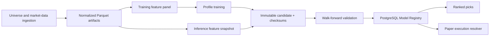

# AiStockCN System Design

AiStockCN is a unified multi-market product for source-grounded company research, quantitative model governance, portfolio workflows and controlled execution.

**Audience:** product engineering, AI engineering, quantitative research and operations

**Documentation baseline:** 14 August 2026

## Design goals

- Keep China A-share and US market data, currencies, models and execution rules isolated.
- Provide one coherent customer product without coupling long-running workloads to page requests.
- Make every model deployment, financial calculation and AI citation traceable to persisted inputs.
- Separate customer research from administrative and operational controls.
- Prefer deterministic financial computation and immutable artifacts where consistency matters.
- Make failures observable and work safely retryable.

## System context

## Product surfaces

| Surface | Authorization | Backend |
| --- | --- | --- |
| CN/US Overview | Investor or administrator | `panel-api` and `us-market-api` |
| CN/US Research | Investor or administrator | `research-api` plus market services |
| CN/US Quant | Investor or administrator | market API plus Model Registry |
| CN/US Portfolio | Investor or administrator | account state or research baskets |
| CN/US Execution | Investor or administrator | controlled CN workflow or US readiness-only gates |
| Platform operations | Administrator | `panel-api` |
| Research operations and evaluation | Administrator | `research-api` |

The web application is the public boundary. Internal FastAPI services bind to loopback on the host and accept requests only from configured networks or trusted service identities.

## Application architecture

### Next.js product

`apps/web` provides authentication, authorization, market-aware navigation and server-side request forwarding. It owns the customer presentation boundary and prevents browser clients from reaching internal APIs directly.

Both markets use the same shell and five-stage navigation. Canonical routes are `/cn/{stage}` and `/us/{stage}`. The market switcher retains the current stage, while legacy URLs redirect with their query parameters intact.

### Panel API

`app.main:app` serves the established A-share data and control plane:

- pipeline and reference-data status;
- dataset exploration;
- selections and inference snapshots;
- Model Registry state and activation;
- portfolio and paper-trading reconciliation;
- administrator workflow controls.

### US Market API

`app.us_market_main:app` is a separate read-only service for:

- the US stock master and exchange universe;
- current daily observations and coverage metadata;
- company search;
- rules-based selection snapshots;
- US model and paper activation gates.

The independent `us_5d_v1` profile cannot consume A-share training samples or execution rules. Historical-data, corporate-action and walk-forward gates control model and paper activation.

### Research API and workers

`app.research_main:app` handles company research, source documents, financial facts, retrieval, agent execution, filing changes and evaluation. CPU- and I/O-intensive work runs in separate workers.

PostgreSQL queues use atomic claims with `FOR UPDATE SKIP LOCKED`. Work state and retry metadata are durable, allowing an interrupted worker to resume without relying on in-memory process state.

## Research data model

Actual schema initialization is implemented in the research document, financial and filing-change services. The diagram shows ownership and lineage rather than every physical column.

## Retrieval and answer generation

1. Document extraction preserves PDF page numbers or honest SEC HTML passage locators.
2. Text is split into overlapping chunks and embedded with the market profile: `BAAI/bge-small-en-v1.5` for US English or `BAAI/bge-small-zh-v1.5` for Chinese filings.
3. PostgreSQL `english` or `simple` full-text search plus `pg_trgm` produces lexical candidates.
4. `pgvector` cosine similarity produces semantic candidates.
5. Reciprocal-rank fusion combines both result sets.
6. A market-specific PyTorch cross-encoder reranks the candidate passages.
7. The agent receives a bounded evidence set plus approved tool output.
8. The server attaches citation metadata and validates the structured response.

The evidence record exists independently from the model's prose. This makes a cited claim inspectable even if the synthesis layer is changed.

## Market capability contract

`GET /api/markets/{market}/capabilities` returns each stage's market, status, mode, as-of time, permitted actions and blockers. It derives US model readiness from adjusted-history coverage and Model Registry validation; CN execution derives permission from the active deployment and paper flag. Frontend code does not invent availability.

## Deterministic financial boundary

SEC facts are stored with original taxonomy, concept, unit, period, filing form and accession. Canonical concept priorities select comparable values without deleting source lineage.

Annual and quarterly changes, margins, free cash flow, returns and volatility are computed in Python. The LLM can plan these tools and interpret the result; it cannot replace the typed calculation output.

## Quantitative pipeline

Training does not activate a model. Each candidate is written to an immutable artifact path with a SHA-256 manifest. Validation state and deployment state live in PostgreSQL.

## Model Registry

The Model Registry removes ambiguity between the model shown in Models, the snapshot used by Picks and the artifact used by Paper Trading.

| Table | Responsibility |
| --- | --- |
| `model_versions` | Market, version, profile, artifact path, manifest, training dates, validation and metrics |
| `model_deployments` | Exactly one active version per market, paper permission and monotonic revision |
| `model_activation_events` | Previous/new version, actor, reason, paper state and audit history |

Activation updates the deployment and audit event in one transaction. Consumers resolve the same deployment row. A paper-enabled deployment must resolve exactly to `quant_data/model_registry/{market}/{model_version}`; mutable training workspaces under `model_profiles` cannot be activated. The paper executor verifies artifact checksums and keeps one resolved revision for the entire reconciliation cycle.

`run/model_profiles.json` is a training-profile catalog, not deployment state.

## Reliability controls

| Risk | Control |
| --- | --- |
| Long AI response | SSE lifecycle events and 10-second heartbeats |
| Unknown agent action | Schema validation and a server-side tool allow-list |
| Hallucinated citation | Server-owned source metadata attached after retrieval |
| Numeric inconsistency | Deterministic typed calculation tools |
| Duplicate document | SHA-256 deduplication and accession lineage |
| Interrupted background work | Durable PostgreSQL state, atomic claim and bounded retry |
| Conflicting model consumers | Transactional Model Registry deployment row |
| Unauthorized operations | Signed session, role checks and private API network boundary |
| Opaque retrieval change | Persisted Top-1, MRR and lexical-baseline evaluation |

## Security model

- Passwords are stored as scrypt hashes; plaintext password configuration is rejected.
- Session cookies are signed, HTTP-only and secure in production.
- Administrator authorization is checked on server routes and page entry points.
- Internal APIs restrict source networks and service identities.
- Runtime secrets, customer documents, model caches, datasets and logs are ignored by Git.
- Example configuration defines shape only and must be replaced before use.
- SEC access uses declared identification and controlled request pacing.

## Deployment model

Docker Compose is the local and current server deployment entry point. The main runtime separates:

- `panel-web`;
- `panel-api`;
- `us-market-api`;
- `research-api`;
- scaled `research-worker` processes;
- `research-coverage-worker`;
- existing PostgreSQL/pgvector services and the configured Groq credential.

Services are restarted independently, so research ingestion does not require rebuilding or restarting the A-share execution path.

## Observability

- request IDs and structured API latency logs;
- LangGraph node traces, per-tool latency and citation-validation metrics;
- pipeline state and per-step artifacts;
- research run and filing-change history;
- document and job status in the administrator workspace;
- selection snapshot and market-data freshness;
- Model Registry activation and rollback audit events;
- persisted retrieval evaluation runs.
